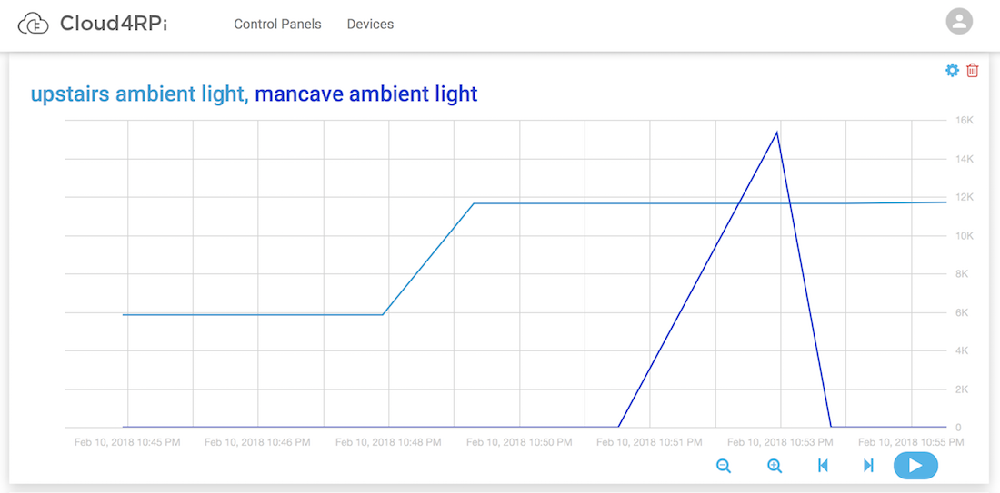

# Hue2Cloud4RPi

Get data from Hue bridge and upload it to Cloud4rpi.



## Instructions

1. You need to know the address of your Hue bridge. [Philips lists some options](https://developers.meethue.com/documentation/getting-started). I just used ```tcpdump -ni <interface> -A multicast```
1. You need an api key for your bridge. See again [Philips documentation](https://developers.meethue.com/documentation/getting-started)
1. You need cloud4rpi device token. You can get it by creating a [new cloud4rpi device](https://cloud4rpi.io/devices)

## Configure

### Option A: use a config file

First clone this repository to yourself.
Copy ```code/config.py.example``` to ```code/config.py``` and add your configuration.
See "Instructions" section to figure out correct values.

### Option B: use environment variables

You can set the following environment variables:

 * bridge_ip
 * huetoken
 * cloud4rpi_device_token


## Build & Run

You need to build every time you change the configuration file.

```shell
docker build -t riphue .
```

If you have build a working setup already, you can just run.

```shell
docker run -ti --rm riphue
```

You can also send the environment variables from the host system. But you need to understand
anyone else using that system will see those. In general, it is safe to assume people with access
to the host system will have access to the container, unless proven otherwise.

```shell
docker run -e huetoken="<hue token>" -e cloud4rpi_device_token="<cloud4rpi device token>" -e bridge_ip="<the ip of your hue bridge" -ti --rm riphue
```
## References

* <https://github.com/quentinsf/qhue>
* <https://developers.meethue.com/documentation/getting-started>

Kudos to Turmi0 for pointers and examples.